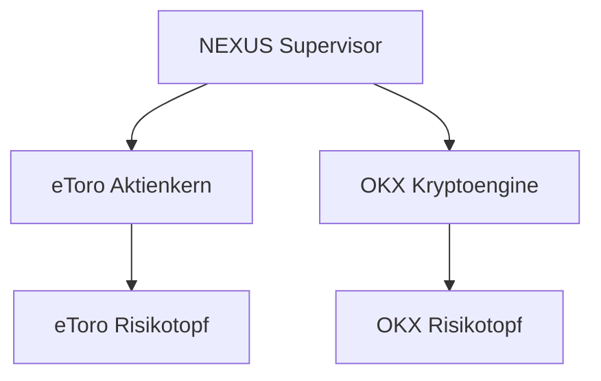

# Architektur TradingBot 8.1.1 NEXUS

## Getrennte Handelsdomaenen

eToro und OKX laufen gleichzeitig, aber mit getrennten Brokerzustaenden,
Risikotoepfen, Laufzeitdateien und Live-Freigaben. Ein Fehler oder ein
geschlossener Aktienmarkt in einer Domaene stoppt die andere nicht.

| Domaene | Markt | Zeitplan | Universum | Freigabe neuer Werte |
|---|---|---|---|---|
| eToro | Aktien | Marktzeiten, Positionsschutz separat | 75 Kern + max. 25 dynamisch | zweistufig ueber Telegram |
| OKX EEA | Spot-Krypto | 24/7; 5m/15m/1h | BTC/ETH/SOL + dynamisch | autonom nach harten Filtern |

## OKX-Daten- und Geldpfad

- Oeffentliche Instrumente, Ticker, Orderbuch und fertige Kerzen kommen ueber
  die OKX-EEA-REST-API.
- Private Account- und Orderereignisse werden ueber den EEA-WebSocket
  empfangen. Bei Trennung, veralteten Daten oder fehlendem Paket wird
  automatisch REST verwendet.
- Jede Order wird ausschliesslich ueber REST gesendet. Ein Transportabbruch
  nach dem Absenden gilt als unbekannter Zustand und darf nicht blind
  wiederholt werden.
- `sCode` wird pro Ergebniszeile geprueft, auch wenn der obere Antwortcode
  Erfolg meldet.
- LIVE erfordert korrekte Systemzeit, Read+Trade ohne Withdraw, Spot/Cash und
  ein kurzlebiges lokales OKX-Arming.

## Entscheidungs- und Quellenpfad

Technik, Risiko, Broker, News und optionale KI liefern getrennte Beitraege.
Das Journal speichert Entscheidung, Hauptquelle, einzelne Quellen,
Paper/LIVE, Order-ID, Fill und Ausfuehrungsstatus. KI priorisiert oder
interpretiert nur und besitzt keine Order- oder Freigaberechte.

## WebUI

Die FastAPI-WebUI ist ein eigener Dienst und liest Laufzeit- und
Journalzustaende. Einstellungen werden erlaubnislistenbasiert gespeichert;
Geheimfelder werden nie zurueckgegeben. Das Logbuch verwendet SQLite mit
serverseitigen Filtern, `LIMIT` und `OFFSET`, sodass auch Folgeseiten stabil
funktionieren. Die WebUI hat keine Route fuer Orders oder Live-Arming.

Der Zugriff ist standardmaessig nur lokal. Fuer iPhone und Laptop wird die
private WireGuard-IP gebunden; Wildcard- und oeffentliche Adressen sind
gesperrt.

## Migration

Die Migration bevorzugt die vollstaendigste gefundene Vorgaengerversion,
uebernimmt Schluessel, Profile, Favoriten, Historie und kompatible Zustaende
und schreibt einen geheimnisfreien Bericht. Danach werden eToro und OKX
zwingend auf Paper/Demo gesetzt und alte Arming-Dateien entfernt.
